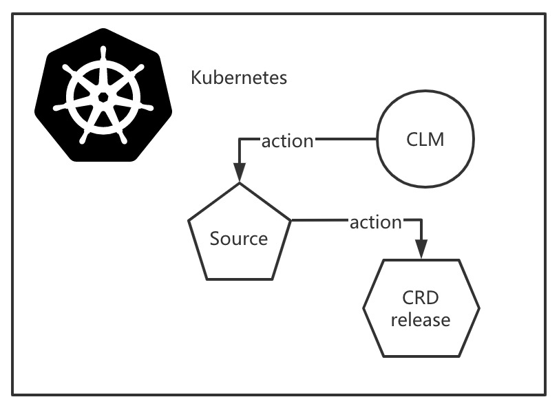
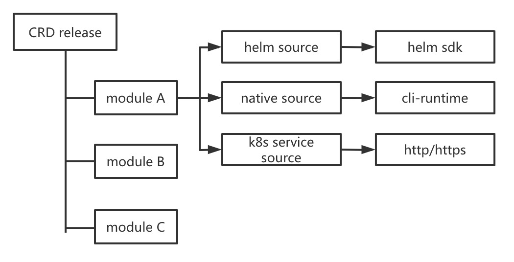
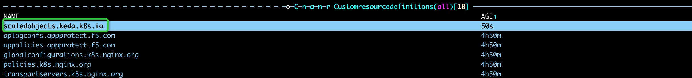
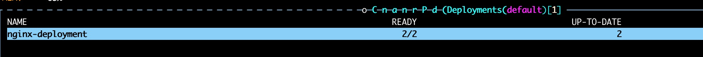
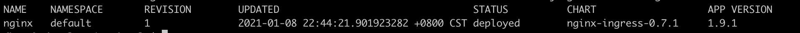
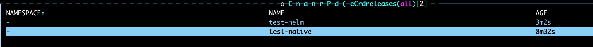

# CLM
CLM (CRD Lifecycle Management) is a tool to manage CRDs lifecycle in Kubernetes. CLM can contribute to:
1. Install CRD (yaml file and controller);
2. Probe status of CRD components;
3. Recover abnormal CRD components;
4. Upgrade and downgrade CRD;
5. Dependency processing of CRD;  

And it can be a special workload of Kubernetes.

## Architecture
CLM contains three components:

* Source: Source of CRD release, contains the actually actions to handle CRD release.
    * helm source: Using helm-sdk to handle lifecycle actions
    * native source: Using cli-runtime
    * k8s service source: Using http/https  
    CLM combine the `helm` and `kubectl` to manage the CRD lifecycle.
* CRDRelease: A release of CRD.

* Module: The components of a CRDRelease. The smallest entity CLM handle.

See docs for more information.

## Quick Start
* `make install` Install CRD of CLM.

* `kubectl apply -f clm-server.yaml` Install CLM deployment to K8s cluster.

* `cd config/sample/; kubectl apply -f source` Install sources of CLM.

* `kubectl apply -f crdrelease/native-example.yaml` Install the example crd release of native source.
 

    * native.module contains two parts in native source, a remote urls CRD file resource, and a local deployment yaml.

* `kubectl apply -f crdrelease/helm-example.yaml` Install the example crd release of helm source.

    * nginx.module download a nginx helm package and install it.

* Check the crd releases installed.

## Development setup
Please read `Makefile`

## Contributing
1. Fork it
2. Create your feature branch (git checkout -b feature/fooBar)
3. Commit your changes (git commit -am 'Add some fooBar')
4. Push to the branch (git push origin feature/fooBar)
5. Create a new Pull Request

## Meta
Jungle - 353187194@qq.com
Distributed under the Apache 2.0 license. See LICENSE for more information.

